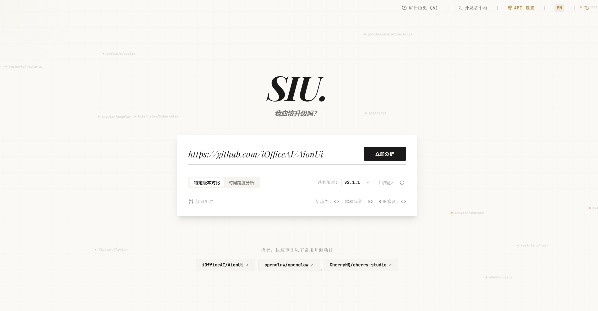
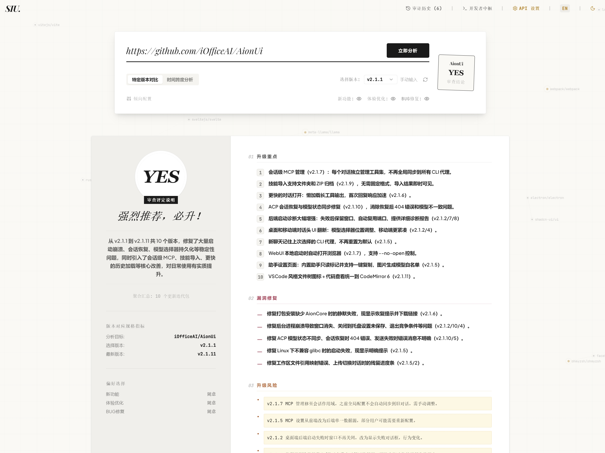

# SIU - Should I Upgrade?

**Should I Upgrade?**

这是每个软件用户、开源项目使用者、依赖维护者都会遇到的那个小问题。

你打开 GitHub，发现自己落后了好几个版本。Release Notes 一条接一条，有新功能、有修复、有重构、有看不懂的内部调整。你真正想知道的不是“新版发布了吗”，而是：

**我现在到底该不该升级？**

SIU 就是为这个问题做的。

它会读取你当前版本到最新正式版本之间的 GitHub Releases，清洗掉 changelog 里的噪音，再让 AI 像一个冷静的版本审查员一样，把新功能、体验优化、BUG&漏洞、升级风险整理成一份能看懂的报告，最后给出一个直接判断：

```text
YES / MAYBE / NO
```

在线体验：

**Demo:** [https://siu-bbg.pages.dev/](https://siu-bbg.pages.dev/)





## SIU 想解决什么

大多数升级提示只会告诉你：

- 有新版本。
- 这里是一大段 Release Notes。

但这不够。

你真正需要的是一个更接近人工判断的答案：

- 这些更新和这个项目的核心用途有关吗？
- 新功能是不是用户真的能感知到？
- BUG 修复是普通维护，还是会影响核心使用？
- 有没有发布者明确提醒的破坏性变更？
- 如果我只关心体验优化，这次还值不值得升？

SIU 尝试把“读 changelog”这件事，变成一次更清楚的升级决策。

## 它会看什么

SIU 会综合这些信息：

- GitHub 最新正式版本。
- 你当前版本之后的所有正式 Releases。
- 项目描述、topics、主要语言和 README 摘要。
- Release Notes 中的新功能、优化、BUG、漏洞和风险。
- 你的偏好：新功能、体验优化、BUG修复。

然后输出：

- 最终建议：`yes` / `maybe` / `no`
- 一句能听懂的升级理由
- 升级重点
- 漏洞与关键 BUG 修复
- 升级风险
- 逐版本更新摘要

## 偏好会影响结果

不同用户关心的东西不一样。

有人只想要新功能，有人只在乎稳定，有人最怕 BUG 和漏洞。SIU 的最终评定会更多参考你的偏好。

当前支持三类倾向：

- 新功能
- 体验优化
- BUG修复

默认全部为“随意”：

```json
{
  "features": "neutral",
  "ux": "neutral",
  "bugs": "neutral"
}
```

如果你不关心新功能，普通 feature 就不应该把结论硬推成 YES。  
如果你强烈关注 BUG 修复，那么真正影响核心流程的修复就应该有更高权重。

## 它不是漏洞扫描器

SIU 不替代 CVE 数据库、依赖安全扫描、人工迁移测试或维护者升级指南。

它更像是：

> 一个帮你快速读完多个版本 Release Notes 的升级判断助手。

它会尽量避免把普通修复说成高危，也不会凭空猜测升级风险。只有发布者明确提示，或变化本身非常明显时，才会把风险写进报告。

## 开发者接入

SIU 目前还没有开放公共托管 API。

这不是疏忽，而是刻意保守：提示词、偏好系统、JSON 结构和判断规则还在迭代，太早开放 API 会让外部用户被一个尚未稳定的契约绑住。

现在更推荐两种方式。

### 方案 A：自行接入

你可以复刻 SIU 的分析链路：

1. 使用 GitHub API 获取正式 Releases。
2. 过滤 draft 和 prerelease。
3. 找到当前版本到最新版本之间的发布记录。
4. 清洗 Release Notes。
5. 把仓库画像、用户偏好、版本日志发送给大模型。
6. 要求模型只返回固定 JSON。
7. 用 JSON 渲染自己的报告或命令行结果。

核心数据格式大概是这样：

```json
{
  "repoName": "owner/repo",
  "currentVersion": "v1.4.0",
  "latestVersion": "v1.8.2",
  "verdict": "maybe",
  "verdictReason": "新版主要是体验优化和普通修复，如果你追求稳定可以先观察。",
  "coreHighlights": [
    "[体验优化] 启动速度和列表渲染更流畅"
  ],
  "criticalFixes": [
    "[BUG] 修复保存失败后状态未回滚的问题"
  ],
  "breakingChanges": [],
  "newFeatures": [],
  "preferences": {
    "features": "neutral",
    "ux": "neutral",
    "bugs": "neutral"
  },
  "versionCount": 12,
  "releaseBreakdown": []
}
```

### 方案 B：让 AI 智能体自动接入

如果你使用 Claude Code、Codex、Cursor 这类工具，可以直接把文档链接交给它，让它按你的项目技术栈实现接入。

文档：

- [AI 智能体接入指南](docs/agent-integration.md)
- [当前汇总分析提示词 v6](docs/analysis-prompt-v6.md)

可以这样对 AI 工具说：

```text
请阅读 docs/agent-integration.md，并在当前项目中接入 SIU 风格的升级分析流程。
不要调用公共 SIU API。请在本项目内复刻 GitHub Releases 获取、日志清洗、大模型 JSON 汇总和报告展示。
```

## 适合谁

SIU 适合这些场景：

- 你正在使用一个更新很快的开源应用。
- 你想知道某个版本跨度到底值不值得升级。
- 你维护项目，想给用户一个更清楚的升级建议。
- 你经常被一堆 Release Notes 劝退。
- 你希望 AI 帮你做第一轮升级审查，但又不想听空话。

## 极简本地运行

项目主体在 `demo/`。

```powershell
cd demo
npm install
npm run build
npx wrangler pages dev dist --ip 127.0.0.1 --port 8788
```

环境变量模板：

```text
demo/.env.example
```

## 极简结构

```text
demo/src/              前端 UI
demo/functions/api/    Cloudflare Pages Functions
demo/server/core/      分析流程核心逻辑
docs/                  接入文档与提示词版本
```

## 部署

当前 Demo 部署在 Cloudflare Pages。

```text
Root directory: demo
Build command: npm run build
Build output: dist
```

更详细的部署说明见：

```text
demo/CLOUDFLARE_PAGES_DEPLOY.md
```

## 社区支持

<a href="https://linux.do/">
  
</a>

感谢 [LINUX DO](https://linux.do/) 社区的大力支持。

## License

MIT License. 完全开源，欢迎使用、修改、分发和二次创作。
